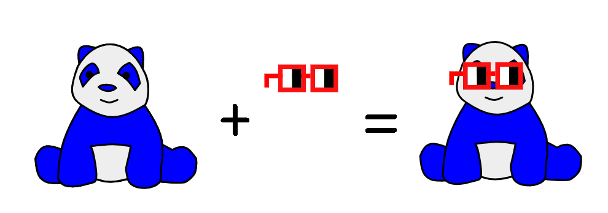

# Party Panda NFT

Colourful onchain composable NFTs based on my toy panda (Rona).

Composable NFTs can have other composable NFTs added, such as adding Nouns Glasses.

*(Party Panda + Nouns Glasses = Party Panda wearing Nouns Glasses)*

Party Panda NFTs are composable NFTs so they can be added to composable NFTs.  e.g. Loogie Tank NFT (like a fish tank) where Nouns Glasses NFTs and Party Pandas NFTs are gently swimming around the tank after being added to the tank NFT:

https://testnets.opensea.io/assets/0x1617a312c06363b66381f51506c86adadb99ad21/1

## EIP4883
Draft [EIP4883: Composable SVG NFT](https://github.com/ethereum/EIPs/pull/4888/files) to standardize composable NFTs